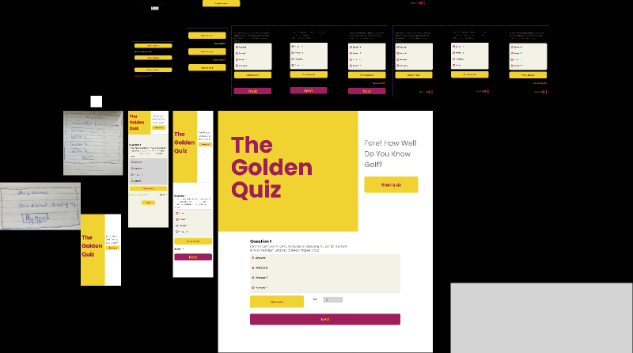
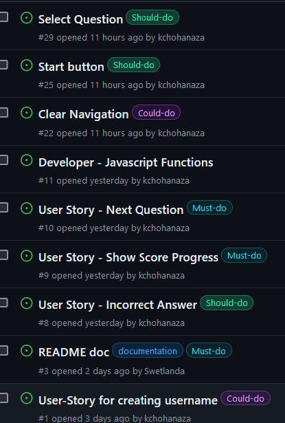
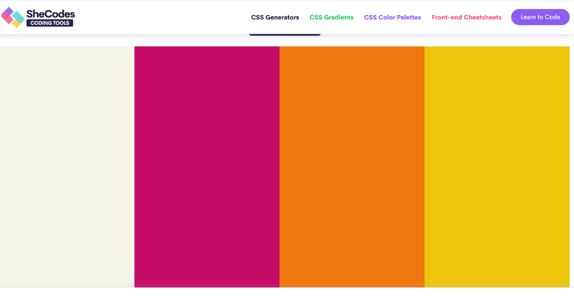
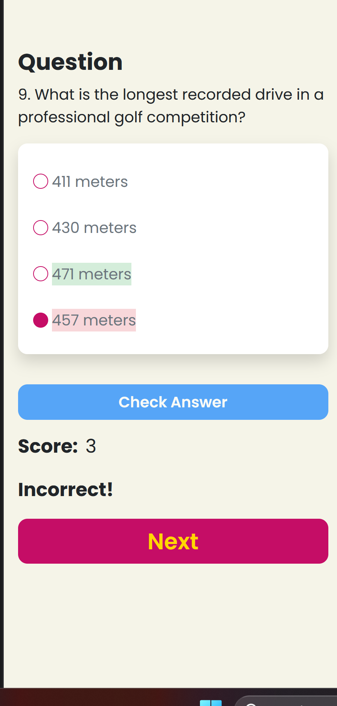

# The Golden Quiz

The Golden Quiz is a captivating interactive game that tests your golf knowledge with multiple-choice questions. Designed for golf enthusiasts and curious minds alike, it offers engaging brain puzzles and challenges for information recall. The sleek, minimalist design ensures accessibility for all users. With a score counter and clear answer options, the game provides a smooth and enjoyable experience.

[View the live project here] (https:/*)

## User Stories
- As a product owner, I want the Quiz to have a modern and attractive design to draw in potential users.
- As a product owner, I want the Quiz to include multiple-choice answers for each question.
- As a product owner, I want the questions to be shuffled each time the quiz is taken to ensure variety.
- As a user, I want to easily navigate through the website to start and play the quiz.
- As a user, I want to know the subject and name of the Quiz before starting.
- As a user, I want a brief introduction or instructions on how to play the Quiz.
- As a user, I want to see the total number of questions in the Quiz.
- As a user, I want a clear "Play" button to start the Quiz.
- As a user, I want to easily read each question and its corresponding multiple-choice answers.
- As a user, I want to select and change my answer before confirming my final choice.
- As a user, I want to confirm my chosen answer for each question.
- As a user, I want to receive immediate feedback to know if my answer is correct or incorrect.
- As a user, I want a "Next" button to proceed to the following question.
- As a user, I want to keep track of my score throughout the Quiz.
- As a user, I want to see my final score upon completing the Quiz.
- As a user, I want the option to replay the Quiz after finishing.
- As a user, I want the Quiz to be responsive and work well on all device platforms.
- As a user, I want the Quiz to be accessible, with features like keyboard navigation and screen reader compatibility.

## Kanban Board

## User Experience (UX)

 
- Simple navigation: A clear instruction to ensure a smooth user experience for all ages and skill levels.
- Responsive Design: Adapts to different devices, from smartphones to desktops, for accessibility and convenience to all users.
- Visually Appealing: Produce a modern, eye-catching aesthetic with a vibrant color scheme to keep users engaged throughout the quiz.
- Clear website and functional to not overwhelm the users.

## Features and Design
- The start page offers a warm welcome message, clearly stating the website's purpose.
- The Golden Quiz features 5  questions stored in an array, with future expansion possible via API integration. 
- Its simple, intuitive layout ensures easy navigation, presenting each question with four answer options.
- Upon selecting an answer, users receive immediate feedback and real-time score updates.
- A "Play Again" button at the end enhances user experience, encouraging replay. 
- The responsive design ensures compatibility across all devices.

### Typography
Google Fonts and Font Awesome were utilized to import the Poppins font and various icons into the HTML and styles.css files. These selections were made for their compatibility, simplicity, and user-friendly appearance. They ensure readability and a clear design across all tested screen sizes.

### Color Scheme
We selected modern and bright colours to have a good contrast and be in style with our name - The Golden Golf Quiz.

### Wireframes

### Languages Used
- [HTML5](https://en.wikipedia.org/wiki/HTML5)
- [CSS3](https://en.wikipedia.org/wiki/Cascading_Style_Sheets)
- [JS](https://en.wikipedia.org/wiki/JavaScript)

### Frameworks, Libraries and Programs Used
- [Google Fonts:](https://fonts.google.com/) Font Poppins were used for the project.
- [Font Awesome:](https://fontawesome.com/) Icons from Font Awesome were added to enhance aesthetics and user experience.
- [Git:](https://git-scm.com/) Git version control via the Gitpod terminal was used by committing changes and pushing them to GitHub.
- [GitHub:](https://github.com/) Serves as the repository for the project's code.
- [Figma:](https://www.figma.com/) Used to create wireframes during the design process.
- [Bootstrap:](https://getbootstrap.com/) Used to create the responsive layout.

### Validator Testing 

- HTML
  - No errors were returned when passing through the official [W3C validator](https://validator.w3.org/)

- CSS
  - No errors were found when passing through the official [(Jigsaw) validator](https://jigsaw.w3.org/css-validator/)

## Testing 

Screen size reflector used to ensure Desktop Monitors, Tablets and Mobile Phone screen sizes are accomodated.

### Unfixed Bugs

## Deployment

- The site was deployed to GitHub pages. 

The live link can be found here - [!INCLUDE LINK!]

## Credits 

- Google Fonts were used for the project.

- Colour pallete was created with SheCodesCodingTools
  - [Colour pallete](https://palettes.shecodes.io/palettes/112)

- This video helped us to inspire the logic for the JavaScript:
  - [GreatStack - How To Make Quiz App Using JavaScript ](https://www.youtube.com/watch?v=PBcqGxrr9g8&t=1263s)

- Chat GPT was utilized to generate questions for the Quizz and to address our coding queries.

- The theme of the project was inspired in honor of our facilitator, Alexander, with special thanks for his help.

- There projects helped us to understand the Quizz and the Readme files:

  - [JS-Hackathon-Quizmasters](https://github.com/ifzalmalook/Hackathon2/)

  - [Tipsy Trivia: The Code Inquiziters Pub Quiz](https://github.com/alphabetjim/JS-Hackathon-Quizmasters/)

## Future Features
- Using API Fetch function to load questions. 
- Adding Time function so motivate users and make a Quizz more challenging.
- Adding celebration function on scoring full marks in Quizz.
 

## The Golden Golf Quiz Developer Team
- Khadeeja - Kchohanaza@gmail.com
- Oluwole Akani - oakani@gmail.com
- Neeru - neerurathour@gmail.com
- Lola - swetlanda@gmail.com
